# Jason Matthew Suhari

### Creator of [GridBash](https://github.com/jasonsuhari/gridbash) | Co-founder & CTO at [Fluent](https://getfluent.tech)

I build AI agents, developer tools, and accessible software that help people use computers more effectively.

[Portfolio](https://www.jasonsuhari.com) | [LinkedIn](https://linkedin.com/in/jasonsuhari) | [Writing](https://medium.com/@jasonmatthewsuhari) | [X](https://x.com/jsonphile) | [Email](mailto:jason.suhari@u.nus.edu)

<picture>
  <source media="(max-width: 600px)" srcset="images/system-map-mobile.svg">
  
</picture>

<strong>Open the operations console</strong>

 

<pre>
jason@github:~$ whoami
Jason Matthew Suhari

jason@github:~$ ls ~/build
gridbash/   fluent/   orangeboard/   faultline/   godot-mcp/   grift/

jason@github:~$ cat focus.txt
AI agents
developer tools
accessible computer use
geospatial systems

jason@github:~$ ./collaborate
open https://jasonsuhari.com
</pre>

## What I am building

I am a software engineer and product builder from Indonesia, based in Singapore. I study Data Science and Computer Science at the National University of Singapore.

- **[GridBash](https://github.com/jasonsuhari/gridbash):** a cross-platform Rust terminal grid for running Codex, Claude, Gemini, and other CLI coding agents side by side.
- **[Fluent](https://getfluent.tech):** a multimodal accessibility desktop agent designed to make computers easier to use.

My work sits at the intersection of **AI agents**, **developer experience**, **accessibility**, and **applied product engineering**.

## Selected work

| Project | What it does | Built with |
| --- | --- | --- |
| **[GridBash](https://github.com/jasonsuhari/gridbash)** [Website](https://jasonsuhari.github.io/gridbash/) | Runs multiple CLI coding agents in a fast, keyboard-first terminal workspace. | Rust, Ratatui, PTYs |
| **[Fluent](https://getfluent.tech)** [Releases](https://github.com/jasonsuhari/fluent-releases) | Provides multimodal computer assistance for people with accessibility needs. | AI agents, computer use, Windows |
| **[Orangeboard](https://github.com/jasonsuhari/orangeboard)** [Demo](https://orangeboard-inky.vercel.app) | Maps outdoor advertising inventory, scores visibility, finds nearby buyers, and generates campaigns. | TypeScript, Next.js, Mapbox |
| **[Faultline](https://github.com/jasonsuhari/floodline-superainext)** | Turns flood risk into live reports, 3D city simulations, mitigation plans, and response briefs. | TypeScript, geospatial AI, Three.js |
| **[Godot MCP](https://github.com/jasonsuhari/godot-mcp)** | Gives AI agents 16 tools for editing, running, rendering, and playtesting Godot projects. | Python, MCP, Godot |
| **[grift](https://github.com/jasonsuhari/grift)** | Securely saves and switches between multiple Claude Code accounts without dependencies. | Bash, CLI tooling |

## How I build

<kbd>Rust</kbd> <kbd>TypeScript</kbd> <kbd>Python</kbd> <kbd>JavaScript</kbd> <kbd>Shell</kbd>

<kbd>Next.js</kbd> <kbd>React</kbd> <kbd>FastAPI</kbd> <kbd>Godot</kbd> <kbd>Supabase</kbd> <kbd>Docker</kbd> <kbd>Vercel</kbd>

**Focus areas:** AI agents, CLI tooling, accessibility, geospatial systems, applied machine learning.

I like small, legible systems; tools that feel fast; and products whose usefulness is obvious within the first minute.

## Work with me

I am open to thoughtful collaborations around developer tools, agentic software, accessibility, and ambitious product prototypes.

**[jasonsuhari.com](https://www.jasonsuhari.com)** | **[LinkedIn](https://linkedin.com/in/jasonsuhari)** | **[jason.suhari@u.nus.edu](mailto:jason.suhari@u.nus.edu)**
