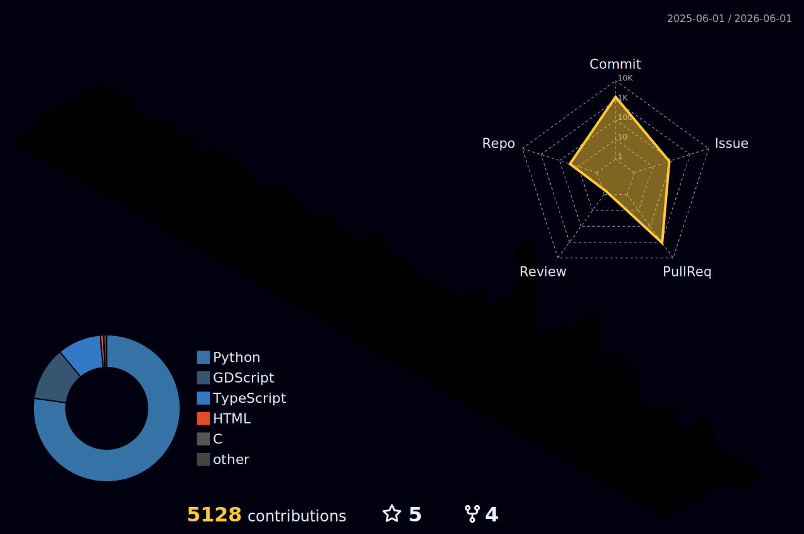

<!-- ═══════════════════════════════════════════════════════════════════ -->
<!--  ██╗  █████╗   ██████╗  ██████╗  ███╗   ██╗                          -->
<!--  ██║ ██╔══██╗ ██╔════╝ ██╔═══██╗ ████╗  ██║     this README is over- -->
<!--  ██║ ███████║ ╚█████╗  ██║   ██║ ██╔██╗ ██║     engineered on purpose -->
<!--  ██║ ██╔══██║  ╚═══██╗ ██║   ██║ ██║╚██╗██║     — jason, probably     -->
<!--  ██║ ██║  ██║ ██████╔╝ ╚██████╔╝ ██║ ╚████║                           -->
<!--  ╚═╝ ╚═╝  ╚═╝ ╚═════╝   ╚═════╝  ╚═╝  ╚═══╝                           -->
<!-- ═══════════════════════════════════════════════════════════════════ -->

<!-- ═════════════════════════════ NOW TICKER ═════════════════════════ -->

<!-- NOW:START -->
> **right now** — 🛌 asleep (hopefully) _(last ping: Thu 04:32 SGT)_
<!-- NOW:END -->

<!-- ═══════════════════════════════════════════════════════════════════ -->
<!--                              HERO                                   -->
<!-- ═══════════════════════════════════════════════════════════════════ -->

 

# Jason Matthew Suhari

**Creator of [GridBash](https://github.com/jasonsuhari/gridbash) · Co-Founder & CTO at [Fluent](https://getfluent.tech) · AI systems and developer tools**

 

  

<!-- ═══════════════════════════════════════════════════════════════════ -->
<!--                             ABOUT                                   -->
<!-- ═══════════════════════════════════════════════════════════════════ -->

##  &nbsp;About Me

I'm Jason Matthew Suhari, a software engineer and AI systems builder from Indonesia, based in Singapore. I created [GridBash](https://github.com/jasonsuhari/gridbash), a cross-platform Rust terminal grid for orchestrating CLI coding agents, and co-founded [Fluent](https://getfluent.tech), where I build accessible computer-use software.

I study Data Science and Computer Science at the National University of Singapore. My work spans developer tools, AI agents, accessibility, geospatial products, data engineering, and the occasional game.

 

<!-- ═══════════════════════════════════════════════════════════════════ -->
<!--                          TECH STACK                                 -->
<!-- ═══════════════════════════════════════════════════════════════════ -->

##  &nbsp;Tech Stack

 

 

 

 

<!-- ═══════════════════════════════════════════════════════════════════ -->
<!--                          PROJECTS                                   -->
<!-- ═══════════════════════════════════════════════════════════════════ -->

##  &nbsp;Featured Projects

&nbsp;

&nbsp;

&nbsp;

 

<!-- ═══════════════════════════════════════════════════════════════════ -->
<!--                     3D CONTRIBUTION CALENDAR                        -->
<!-- ═══════════════════════════════════════════════════════════════════ -->

##  &nbsp;Contribution Skyline

 

<!-- ═══════════════════════════════════════════════════════════════════ -->
<!--                          ANALYTICS                                  -->
<!-- ═══════════════════════════════════════════════════════════════════ -->

##  &nbsp;GitHub Analytics

 

<!-- ═══════════════════════════════════════════════════════════════════ -->
<!--                          RECENT SIGNALS                             -->
<!-- ═══════════════════════════════════════════════════════════════════ -->

##  &nbsp;Recent Signals

📡 &nbsp;<code>tail -f ~/github.log</code> &nbsp;·&nbsp; last 5 events &nbsp;·&nbsp; auto-synced every 30 min

 

<table align="center" width="96%">
<tr>
<td>

<!--START_SECTION:activity-->
1. ❗ Opened issue [#240](https://github.com/jasonsuhari/gridbash/issues/240) in [jasonsuhari/gridbash](https://github.com/jasonsuhari/gridbash)
2. 🗣 Commented on [#227](https://github.com/jasonsuhari/gridbash/issues/227#issuecomment-4984070476) in [jasonsuhari/gridbash](https://github.com/jasonsuhari/gridbash)
3. 🔒 Closed issue [#227](https://github.com/jasonsuhari/gridbash/issues/227) in [jasonsuhari/gridbash](https://github.com/jasonsuhari/gridbash)
4. 🎉 Merged PR [#236](https://github.com/jasonsuhari/gridbash/pull/236) in [jasonsuhari/gridbash](https://github.com/jasonsuhari/gridbash)
5. ❗ Opened issue [#239](https://github.com/jasonsuhari/gridbash/issues/239) in [jasonsuhari/gridbash](https://github.com/jasonsuhari/gridbash)
<!--END_SECTION:activity-->

</td>
</tr>
</table>

 

<!-- ═══════════════════════════════════════════════════════════════════ -->
<!--                           QUOTE                                     -->
<!-- ═══════════════════════════════════════════════════════════════════ -->

*"I didn't come this far, just to come this far."*

 

